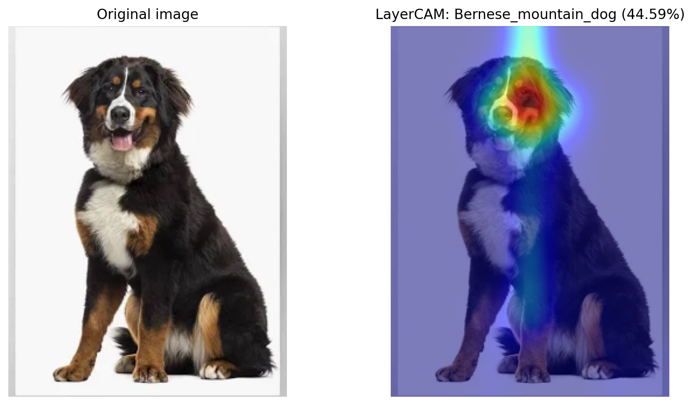
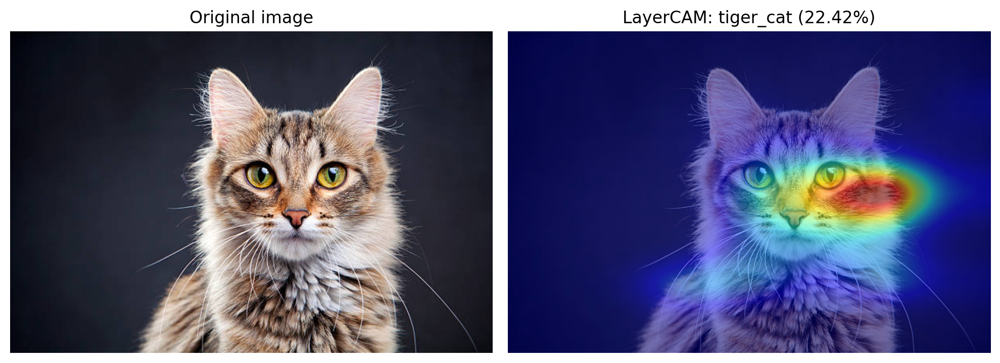
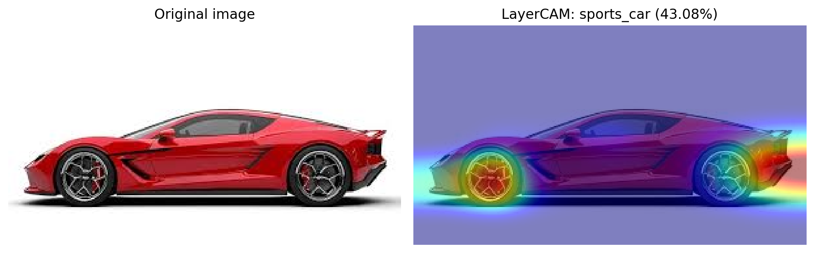
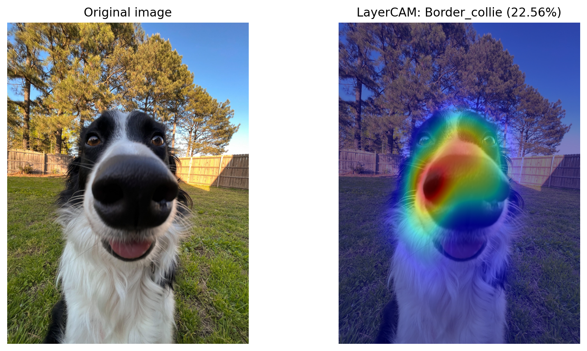
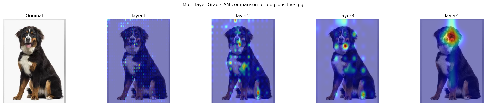
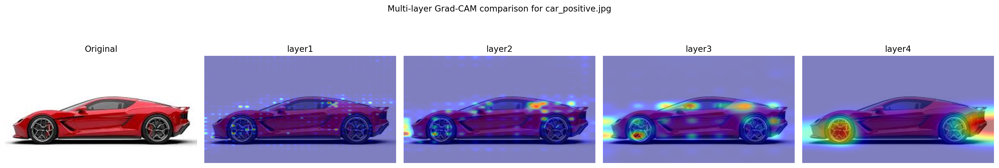
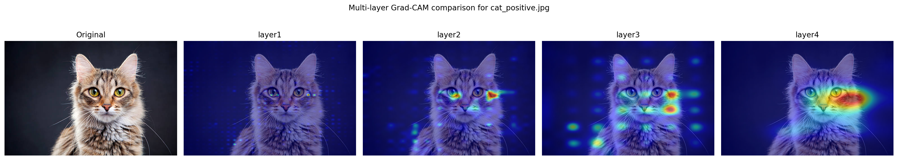
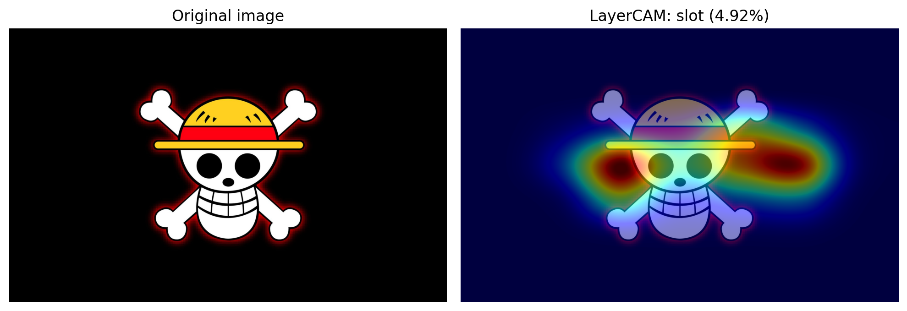

# 🧠 Machine Learning Assignment 2
## 🔍 Interpretability Analysis using CAM (TorchCAM)


---

## 📌 Overview

This project explores **interpretability in Convolutional Neural Networks (CNNs)** using **Class Activation Maps (CAM)**.

The goal is to understand **how a pre-trained model makes decisions** by visualizing the most important regions in input images.

I use:
- 🧠 Pre-trained **ResNet (ImageNet)**
- 🔥 **TorchCAM (LayerCAM)**
- 🖼️ Multiple image categories (dog, cat, car)
- ❌ Negative examples
- 🧠 Multi-layer analysis (**VG requirement**)
- ❓ Unknown object analysis

---

## 🧠 Method

For each image:

- Predict **Top-5 classes**
- Generate **CAM heatmap**
- Overlay CAM on original image

### Multi-layer analysis:
- `layer1` → low-level features (edges, textures)
- `layer2` → simple patterns
- `layer3` → object structure
- `layer4` → semantic understanding

---

## 📊 Results

### 🐶 Dog (Positive Example)



The model focuses strongly on the **face and upper body**, indicating semantic understanding.

---

### 🐱 Cat (Positive Example)



Activation highlights **eyes and ears**, which are key identifying features.

---

### 🚗 Car (Positive Example)



Focus is on **wheels and body structure**, showing object-part awareness.

---

### ❌ Negative Example



Activation is **scattered and less meaningful**, indicating uncertainty.

---

### 🧠 Multi-layer Analysis

#### Dog



#### Car



#### Cat



**Observation:**
- Early layers → edges & textures
- Middle layers → shapes
- Final layer → semantic regions

👉 The network builds understanding progressively.

---

### ❓ Unknown Object



The model fails to classify correctly.

Top predictions:
- slot
- analog_clock
- jigsaw_puzzle

All with **low confidence (~5%)**

👉 The model relies on **visual similarity**, not real understanding.

---

## 🧪 Key Findings

- CNNs rely on **patterns, not true understanding**
- CAM helps explain **model decisions**
- Deep layers capture **semantic meaning**
- Models struggle with **out-of-distribution data**

---

## ⚙️ Setup

Using **uv**:

```bash
uv venv
source .venv/Scripts/activate # Windows
uv pip install -r Labs/Lab2/requirements.txt

---

## ⚙️ Run

python Labs/Lab2/lab2_cam_analysis.py