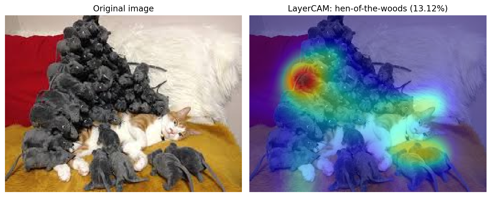
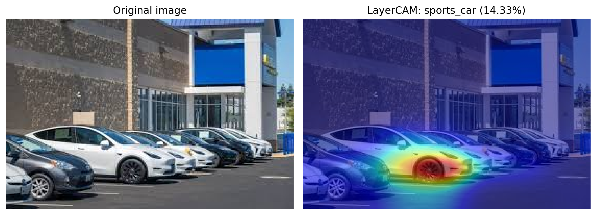

# Assignment 2 – Machine Learning

## Interpretability Analysis using CAM (TorchCAM)

---

## 1. Introduction

Convolutional Neural Networks (CNNs) are widely used for image classification tasks due to their strong performance. However, understanding how these models make decisions is challenging. This is often referred to as the interpretability problem.

One common approach to interpret CNNs is visualization, specifically using Class Activation Maps (CAM). CAM techniques highlight the regions of an image that contribute most to a model’s prediction.

In this assignment, we explore interpretability using TorchCAM by analyzing how a pre-trained CNN model responds to different images.

---

## 2. Model

In this work, a pre-trained ResNet model trained on the ImageNet dataset was used. The model contains 1000 classes and has learned rich visual features from a large dataset.

The final convolutional layer (`layer4`) was used as the default layer for generating activation maps, as it captures high-level semantic features.

---

## 3. Method

I used the TorchCAM library to generate activation maps using LayerCAM.

For each input image:
- The model predicts the top-5 classes
- A Class Activation Map (CAM) is generated for the predicted class
- The CAM is overlaid on the original image

Additionally, multi-layer analysis was performed using layers:
- `layer1` (early features)
- `layer2` (intermediate)
- `layer3` (higher-level patterns)
- `layer4` (semantic features)

---

## 4. Results

### 4.1 Dog (Positive Example)

The model correctly classified the dog image (e.g. *Bernese mountain dog*).
The activation map shows strong focus on the dog’s face and upper body.


This indicates that the model relies on meaningful semantic features.

---

### 4.2 Cat (Positive Example)

The cat image is also correctly classified.
Activation maps highlight the face, especially the eyes and ears.


This suggests that the model identifies key facial features for classification.

---

### 4.3 Car (Positive Example)

The car image is correctly classified.
The activation maps focus on wheels and body structure.


This shows that the model detects object parts relevant for classification.

---

### 4.4 Negative Examples

For negative examples (images that do not belong to the target class), the model often focuses on irrelevant or misleading regions. Activation maps are more scattered and predictions are less confident.

**Dog (negative):**


**Cat (negative):**


**Car (negative):**


---

## 5. Multi-layer Analysis (VG requirement)

### Dog Multi-layer


### Car Multi-layer


### Cat Multi-layer


### Analysis

- Layer 1 detects basic features such as edges and textures. The activation is scattered and not object-specific.
- Layer 2 begins to detect simple shapes and patterns. Some parts of the object become visible.
- Layer 3 shows more structured features and starts focusing on meaningful regions of the object.
- Layer 4 focuses on high-level semantic regions such as the face of animals or the wheels of a car.

**Conclusion:**
The network gradually builds understanding from low-level features to high-level semantic representations.

---

## 6. Unknown Object Analysis

An image not present in ImageNet (a cartoon logo) was tested.


### Observations

- The model fails to classify the image correctly
- Top predictions include:
- slot
- analog_clock
- jigsaw_puzzle
- All predictions have low probability (around 5%)

### Interpretation

The model attempts to map the unknown image to the closest known classes based on visual similarity. In this case, circular shapes in the image lead to predictions related to clocks.

The activation map focuses on the central circular region, showing that the model relies on simple geometric features.

This demonstrates a limitation: CNNs do not truly understand objects and can misclassify unseen data.

---

## 7. Top-5 Predictions Analysis

Example for unknown image:

```text
slot (4.92%)
analog_clock
plunger
jigsaw_puzzle
wall_clock
```

For known images:
- Top-5 predictions are usually similar classes (e.g. different dog breeds)

For unknown images:
- Predictions are unrelated and have low confidence

---

## 8. Discussion

From the experiments, I observe that CNNs rely heavily on visual patterns rather than true understanding. Early layers capture simple features, while deeper layers capture semantic meaning.

CAM visualizations are effective for understanding model behavior. However, models struggle with out-of-distribution data and still produce predictions.

---

## 9. Conclusion

This assignment demonstrated how interpretability techniques such as CAM can help us understand CNN behavior.

### Key findings

- Activation maps reveal important regions of an image
- Multi-layer analysis shows how representations evolve through the network
- Models perform well on known data but fail on unknown data

Understanding these limitations is important for real-world applications.

---

## 10. References

- TorchCAM library
- PyTorch documentation
- Course repository materials
- External tools (ChatGPT, Claude)